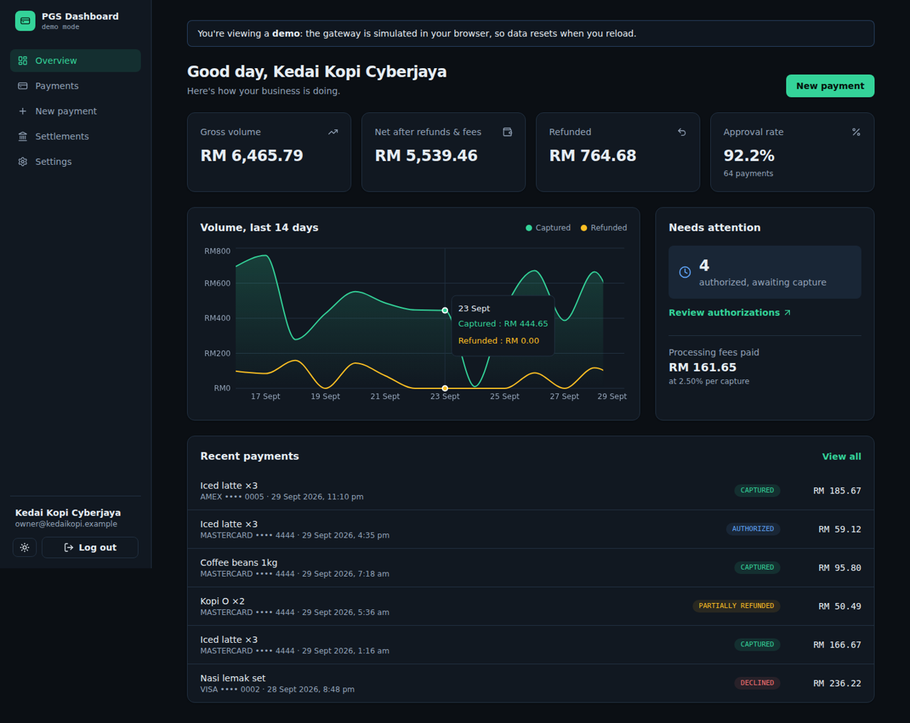
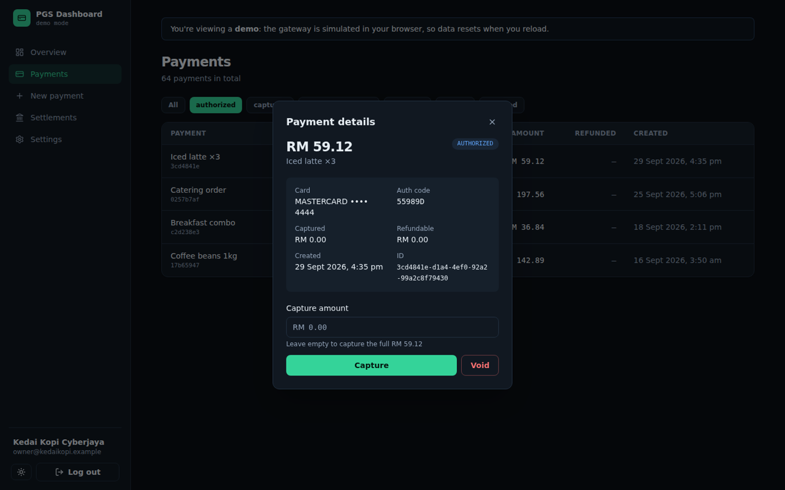
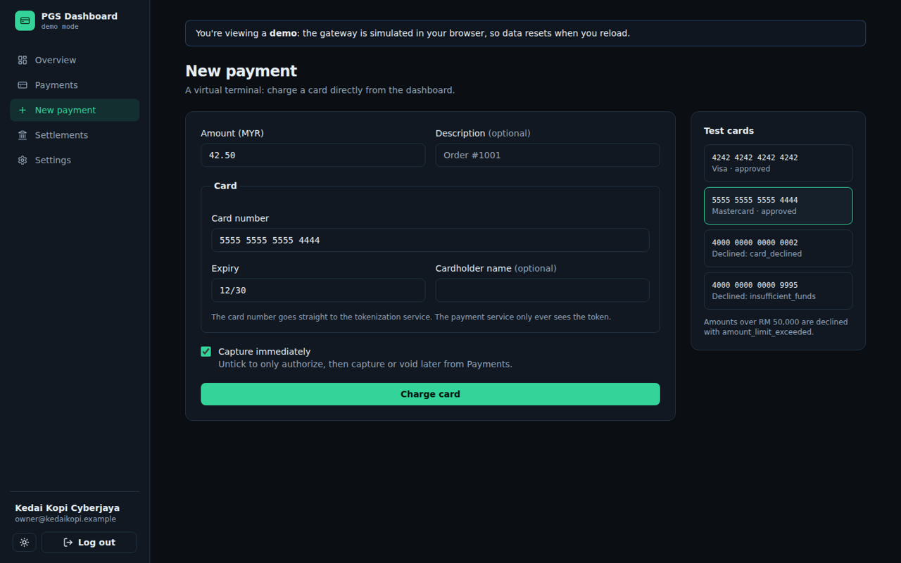

# Merchant Dashboard


The merchant-facing web app for my [Payment Gateway Simulator](https://github.com/amirizalrahmat0799/payment-gateway-sim),
a set of Spring Boot microservices. Merchants sign in with their API key to track payments, capture, void and refund them,
take card payments through a virtual terminal, and follow their settlements.

**[Live demo →](https://amirizalrahmat0799.github.io/merchant-dashboard/)** Click *Try the demo merchant*. The demo runs
the whole gateway in your browser, so no backend is needed.



## Features

| Page | What it does |
|---|---|
| **Overview** | Gross volume, net after refunds and fees, approval rate, a 14-day volume chart, and payments awaiting capture |
| **Payments** | Paged table with status filters. The detail view offers only the actions valid for the current state: capture (full or partial), void, or refund |
| **New payment** | A virtual terminal: tokenizes the card first, then charges the token with an idempotency key |
| **Settlements** | Pending payout, the ledger, settlement history, and a button to trigger the Spring Batch settlement job |
| **Settings** | Account details and API key rotation (the new key is shown once) |

Plus: sign-up for a sandbox merchant, dark and light themes, a responsive layout, and keyboard-accessible dialogs.

| Payment detail | Virtual terminal |
|---|---|
|  |  |

## Engineering notes

- **Idempotent checkout.** One `Idempotency-Key` is generated per checkout attempt and kept until a payment is created.
  The card token is cached for the same card, so a retried request is byte-for-byte identical and the gateway returns
  the original payment instead of charging twice.
- **Card numbers never touch the payment API.** The terminal sends the PAN only to `tokenization-service` and pays with the token.
- **Server state with TanStack Query.** Lists refresh every 10 seconds, and each capture, void or refund invalidates
  exactly the queries it affects (the payment, its refunds, the payment lists and the ledger).
- **Session handling.** The API key is kept in `sessionStorage` (it's cleared when the tab closes). Any `401`,
  for example after the key is rotated elsewhere, ends the session.
- **Typed errors.** Every service returns RFC 9457 Problem Details, which surface directly in the UI (e.g. "Refund amount
  must be between 1 and the refundable amount").
- **Money is integer minor units** end to end. `toMinor("19.99")` is exactly `1999`, with no floating-point rounding.
- **One simulated backend, two uses.** An in-memory gateway (`src/mocks`) follows the same rules as the Java services
  (idempotency, state machine, test cards, settle-once). [MSW](https://mswjs.io) serves it to the browser for the live demo
  and to Node for the tests.
- **Code-split pages.** The charting library loads only when the overview is opened.

## Tech stack

React 19 · TypeScript · Vite · Tailwind CSS 4 · React Router · TanStack Query · React Hook Form + Zod · Recharts ·
lucide-react · Vitest · Testing Library · MSW · oxlint · nginx · Docker · GitHub Actions + Pages

## Getting started

```bash
npm install
```

### Against the real gateway

Start [payment-gateway-sim](https://github.com/amirizalrahmat0799/payment-gateway-sim) (`docker compose up`), then:

```bash
npm run dev          # http://localhost:5173
```

Vite proxies `/merchant-api`, `/payment-api`, `/token-api` and `/settlement-api` to ports 8081–8084, so the browser only
talks to one origin and the Spring Boot services need no CORS configuration. Create a sandbox merchant from the login page.

### Without a backend

```bash
npm run dev:demo     # simulated gateway, demo merchant pre-loaded
```

### With Docker

With the gateway running in Docker:

```bash
docker compose up --build   # http://localhost:3000
```

nginx serves the build and proxies the four API prefixes to the gateway containers on the shared Docker network.

## Scripts

| Command | |
|---|---|
| `npm run dev` / `dev:demo` | Dev server against the real / simulated gateway |
| `npm test` | Unit and page tests (Vitest + Testing Library + MSW) |
| `npm run lint` | oxlint |
| `npm run typecheck` | TypeScript project build |
| `npm run build` / `build:demo` | Production build / static demo build |

## Test cards

| Card number | Result |
|---|---|
| `4242 4242 4242 4242` | Visa, approved |
| `5555 5555 5555 4444` | Mastercard, approved |
| `4000 0000 0000 0002` | Declined: `card_declined` |
| `4000 0000 0000 9995` | Declined: `insufficient_funds` |
| any card, amount > RM 50,000 | Declined: `amount_limit_exceeded` |

## Project structure

```
src/
├── lib/            API client, auth session, TanStack Query hooks, money & stats helpers, types
├── components/     Layout, theme toggle, shared UI (badges, modal, errors)
├── pages/          Login, Overview, Payments (+ detail), New payment, Settlements, Settings
├── mocks/          Simulated gateway (in-memory db + MSW handlers) for the demo and tests
└── test/           Test setup and render helpers
```

## Roadmap

- [ ] Server-sent events from payment-service for instant updates instead of polling
- [ ] Backend-for-frontend with an httpOnly session cookie instead of holding the API key in the browser
- [ ] Refund reasons and CSV export
- [ ] Playwright end-to-end tests against the real gateway in CI

## License

[MIT](LICENSE)
